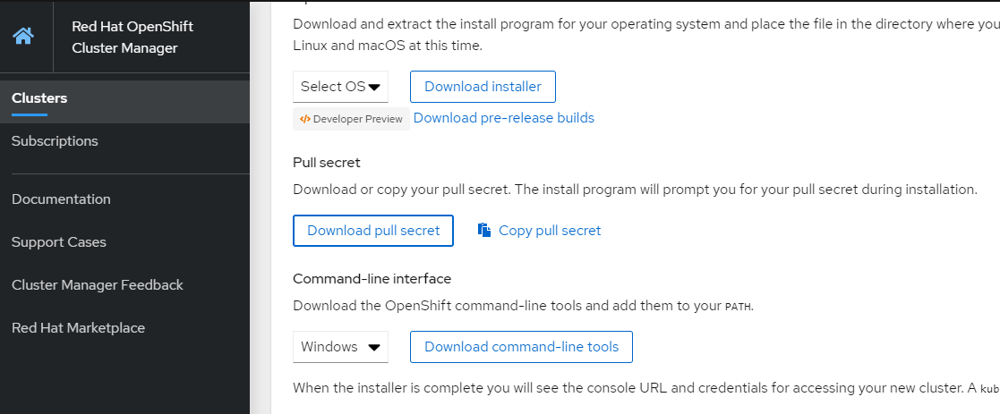

# Install Openshift 4.4.4 on AWS (Internal Red Hat)
OpenShift 4 AWS Installation IPI at OpenTLC 

### Prerequisite
1. Login opentlc
2. Order Catalog > Openshift 4 > Openshift 4 Installation Lab

### Step 1: Login to bastion host (provided on Opentlc's Email)
```bash
> ssh user@host
```
### Step 2: Clone Preparation script from Git and Change below parameter
```bash
> git clone https://github.com/okkyhtf/ocp4-at-opentlc.git
> cd ocp4-at-opentlc/
> vim prepare-openshift-installer.sh
```
### Step 3: Change parameter on preparation script
```properties
export AWSKEY={AWSKEY generated from opentlc}
export AWSSECRETKEY={AWSSECRETKEY generated from opentlc}
export REGION=ap-southeast-1
export OCP_VERSION=4.4.4
export GUID={GUID generated from opentlc}
```

### Step 4: Login as Root and run preparation script
```bash
> sudo -i
> ./prepare-openshift-installer.sh
```

It will shows this log once done,
```
+ oc completion bash
+ echo 'Please exit the session and relogin again to enable the Bash completion.'
Please exit the session and relogin again to enable the Bash completion.

```

### Step 5: Relogin as Root and install ocp
```bash
> sudo -i
> exit
> tmux
> time openshift-install create cluster --dir $HOME/cluster-${GUID} --log-level debug
```

### From installer screen, choose
```
SSH Public Key /root/.ssh/cluster-${GUID}-key.pub
Platform aws
AWS Region = ap-southeast-1
Base Domain = sandbox???.opentlc.com
Cluster Name edwin-cluster
Pull Secret = ***** download from try.openshift.com
```
> During installation, script will ask for pull secret. Download at try.openshift.com .



Below is end of installation screen
```
...
INFO Waiting up to 30m0s for the cluster at https://api.edwin-cluster.sandbox????.opentlc.com:6443 to initialize...
...
DEBUG Still waiting for the cluster to initialize: Working towards 4.4.4: 99% complete, waiting on authentication, console, ingress, monitoring
DEBUG Still waiting for the cluster to initialize: Working towards 4.4.4: 99% complete
DEBUG Still waiting for the cluster to initialize: Working towards 4.4.4: 100% complete, waiting on authentication
DEBUG Cluster is initialized
INFO Waiting up to 10m0s for the openshift-console route to be created...
DEBUG Route found in openshift-console namespace: console
DEBUG Route found in openshift-console namespace: downloads
DEBUG OpenShift console route is created
INFO Install complete!
INFO To access the cluster as the system:admin user when using 'oc', run 'export KUBECONFIG=/root/cluster-cfbf/auth/kubeconfig'

INFO Access the OpenShift web-console here: https://console-openshift-console.apps.edwin-cluster.sandbox???.opentlc.com --> generated
INFO Login to the console with user: kubeadmin, password: ??? --> generated

real    42m54.337s --> time needed for installation
user    0m33.311s
sys     0m2.008s
```

### Step 6: Login from oc client
```bash
> oc login --token=$TOKEN --server=https://api.edwin-cluster.sandbox930.opentlc.com:6443
```
